# 教室で使えるかもしれないもの作り #◯ 「つぼみの写真、どこで探そう」で止まらない。20種類をめくる図鑑アプリ「いろいろな つぼみと 花」

## 🏫 はじめに

「これ、なんの つぼみ？」と聞かれて、答えの写真をすぐに出せなかったことはありませんか。20種類のつぼみと花をカードでめくれるアプリを作りました。

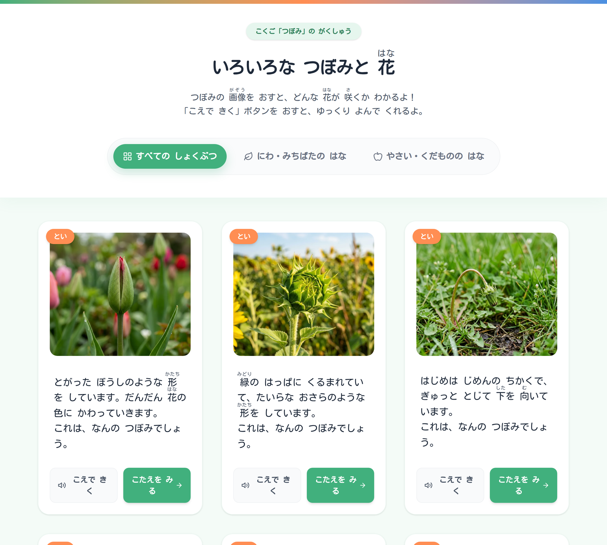

トップページ。上になかまわけのタブ、下にカードが並びます。

1年生の国語に「つぼみ」という説明文があります。あさがお、はす、ききょうの三つを順に取り上げていて、はじめに とい の文がきて、つぎに こたえ の文がくる。その並びを読みとる教材です。文章の組み立てを学ぶ、最初の一歩にあたるところだと思っています。

読みとりが終わったあと、子どもたちの目は教科書の外に向きます。ほかの花のつぼみは、どんな形をしているのか。追いかけたいところですが、6月の校庭にひまわりのつぼみはありません。ききょうもまだです。図鑑を人数ぶん用意するのも、写真を刷って回すのも、その日の午後には間に合わない。

かといって、検索の窓に「つぼみ」と打たせるわけにもいきません。出てくるのは大人向けの育てかたのページで、1年生が読める文ではないからです。写真だけ見せても、教科書で読みとった文の形とはつながりません。

そこで、20種類ぶんのカードを用意しました。おもてには、つぼみの写真と、形をせつめいする文。文の終わりは、かならず「これは、なんの つぼみでしょう。」です。おして裏返すと、咲いた花の写真と、「これは、なんの つぼみです。」の形の文が出てきます。教科書とおなじ順番になっています。

https://tsubomi-learning.giga-school.com/

ブラウザで開くだけで動きます。入れるものはありません。

## 📱 このアプリでできること

画面をひらくと、カードが並びます。パソコンや電子黒板のような横長の画面なら3列、子どもの端末を縦に持てば1列です。並ぶ枚数はどちらでも20枚で、上から下まで送ると全部見られます。

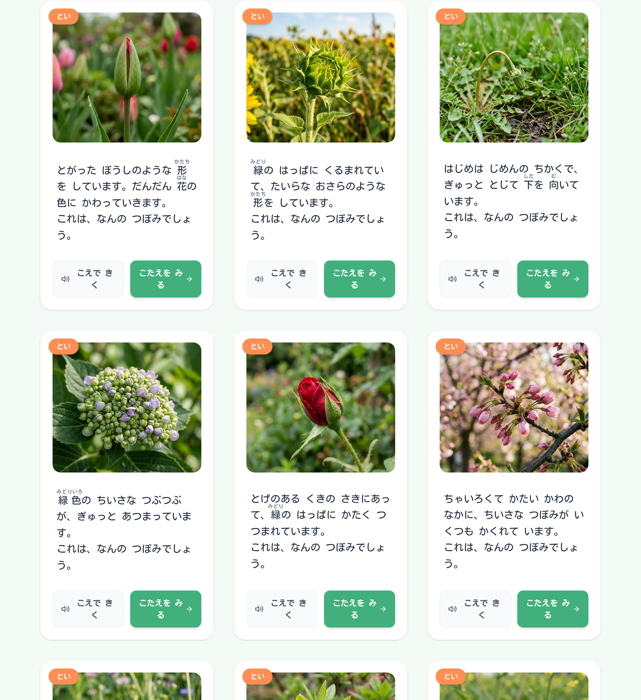

にわ・みちばたの はな 12種類と、やさい・くだものの はな 8種類。あわせて20種類です。

写真は40枚とも正方形で、同じ大きさに切りそろえてあります。つぼみの側と花の側も同じです。カードの高さも、どの一枚も変わりません。文の長さにばらつきがあっても並びが崩れないので、上から下まで送るあいだ、目が引っかかりません。

画面の漢字には、読みにくいものに ふりがな がふってあります。1年生がひとりで読めるようにするためです。

おもてには オレンジ色の とい の札がついています。写真の下にあるのは、つぼみの形だけをせつめいした文です。名前はまだ出てきません。

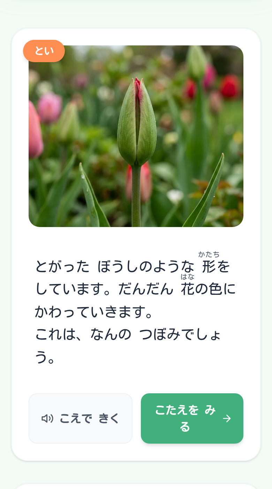

とがった ぼうしのような 形。だんだん 花の色に かわっていきます。

カードのどこをおしても、くるりと裏返ります。写真の上でも、文の上でも、どこでもかまいません。おせるのはカード全体なので、ボタンを探さなくても、どこかに触れば裏が出ます。うらは青い こたえ の札で、咲いたところの写真と、名前を明かす文が出ます。

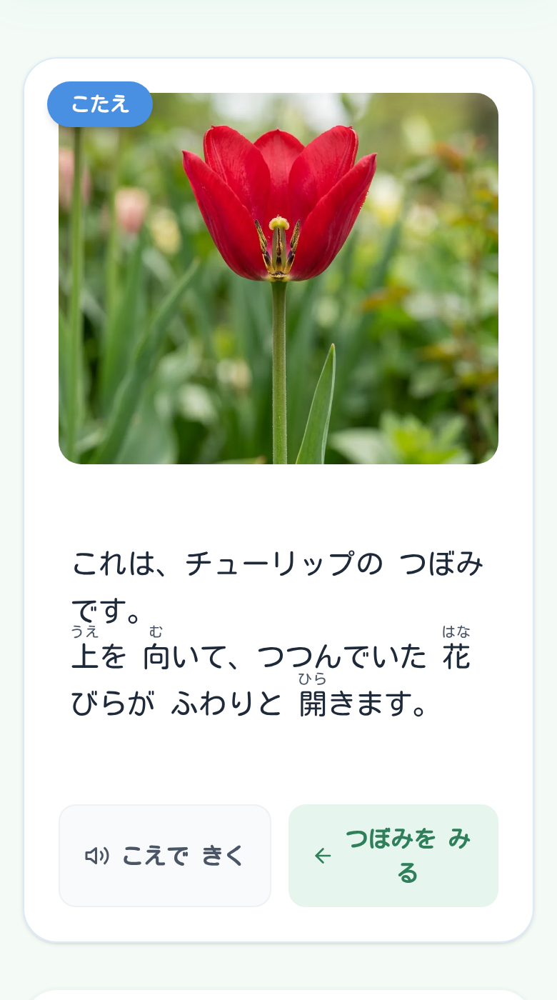

同じカードのうら。上を向いて、花びらが ふわりと 開きます。

裏返すときには、めくったことがわかるように、ぽんという短い音が鳴ります。音を切るボタンは入れていません。20台いっせいに鳴るとにぎやかになるので、音を出したくない場面では、端末の音量を下げてから配ってください。

カードの下には、ボタンが二つ並んでいます。左が「こえで きく」、右が「こたえを みる」です。

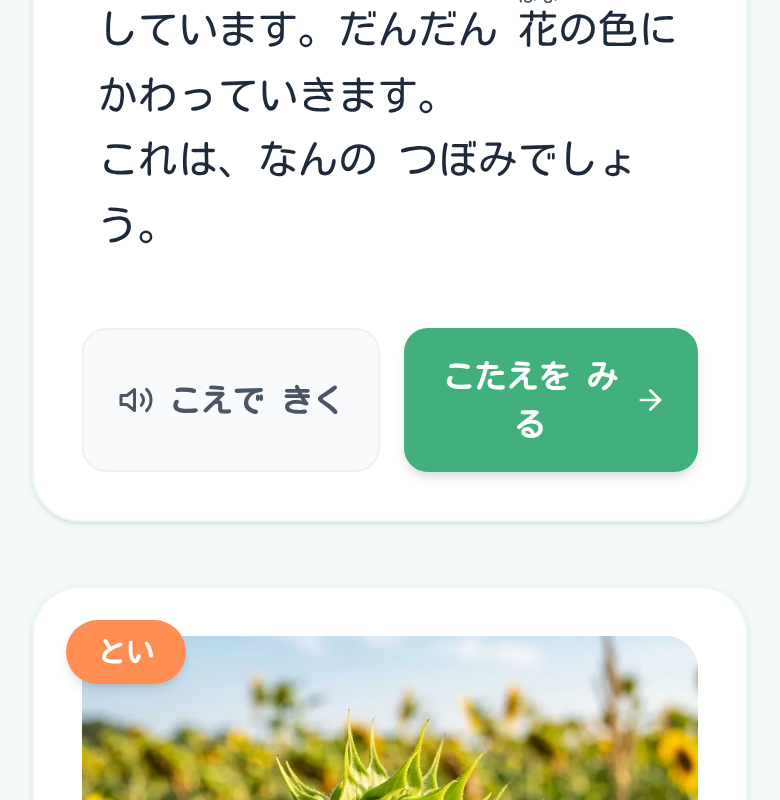

こえで きく は、いま出ている面の文をそのまま読み上げます。

読み上げの速さは、ふつうの0.75倍にしてあります。声もすこし高めです。ゆっくりすぎると感じる先生もいると思います。指で文字を追いながら聞くには、このくらいが合うのではないかと思っています。

ここには、ひとつ細工をしてあります。読み上げるときに読ませているのは、漢字ではなく、ふってある ふりがな のほうです。「形」は かたち、「花」は はな。端末の読み上げは、漢字の読み分けをまちがえることがあるからです。とがった ぼうしのような かたちを しています、と聞こえます。

読んでいる最中にもう一度おすと、そこで止まります。ボタンの文字も とめる に変わるので、いま鳴っているのが自分の端末かどうかが見てわかります。

字を読むのに時間がかかる子は、ここを自分でおせます。先生が読んであげるのを待たなくていい。何度おしても、だれにも気づかれません。

一覧のまま何枚か裏返しておくこともできます。とい と こたえ を横に並べて見くらべると、二つの文の作りのちがいが目に入ります。

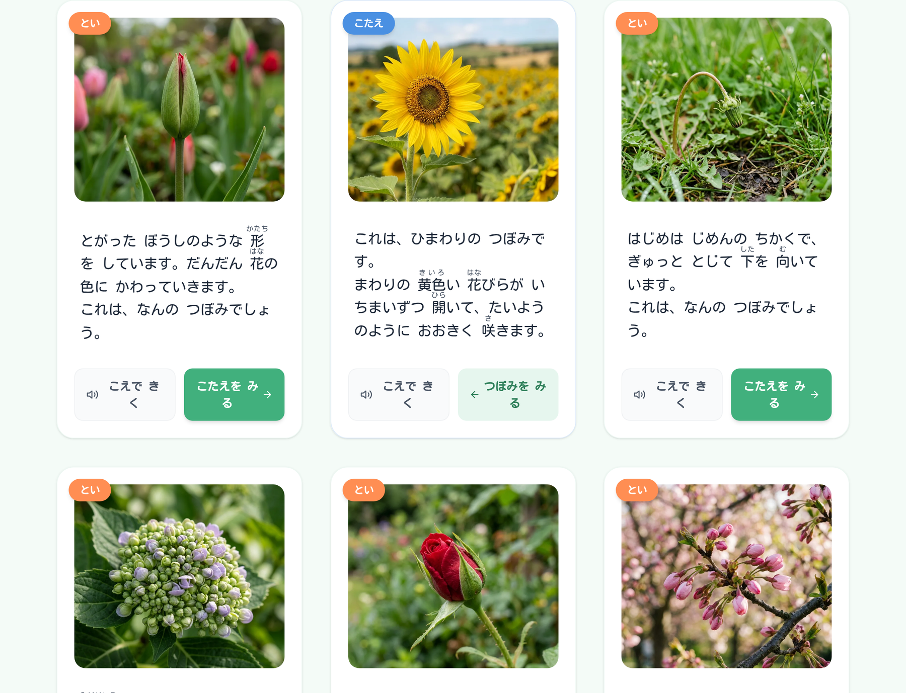

まん中のひまわりだけ、こたえの面にしました。

上のタブでなかまを切りかえると、裏返していたカードはおもてに戻ります。もう一度おなじカードで考えさせたいときは、タブを一往復させてください。

## 💡 答えが先に出てしまわないように、あとから直しました

はじめに作った版では、とい の文がこう始まっていました。「これは、チューリップの つぼみです。とがった ぼうしのような 形を しています。」。形のせつめいより先に、名前が出てしまっていたのです。これでは、そのあとに「これは、なんの つぼみでしょう。」と聞いても意味がありません。20枚ぜんぶが、答えの書いてあるクイズになっていました。文の意味そのものは通っているので、読み流すと気づきません。気づいたのは作った日のうちで、公開するよりは前でした。

いまは、とい の面から名前を抜いてあります。形のことだけを書いて、最後に問いかけて終わる。名前は、裏返したあとの こたえ の面の一文目に置きました。教科書に合わせるためです。

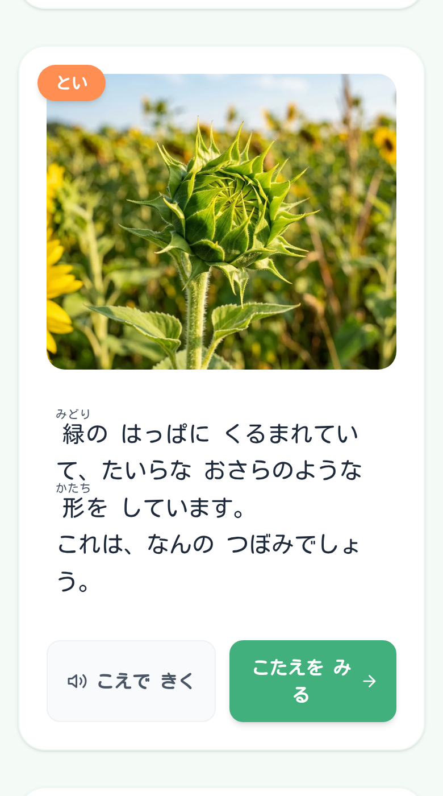

緑の はっぱに くるまれて、たいらな おさらのような 形。

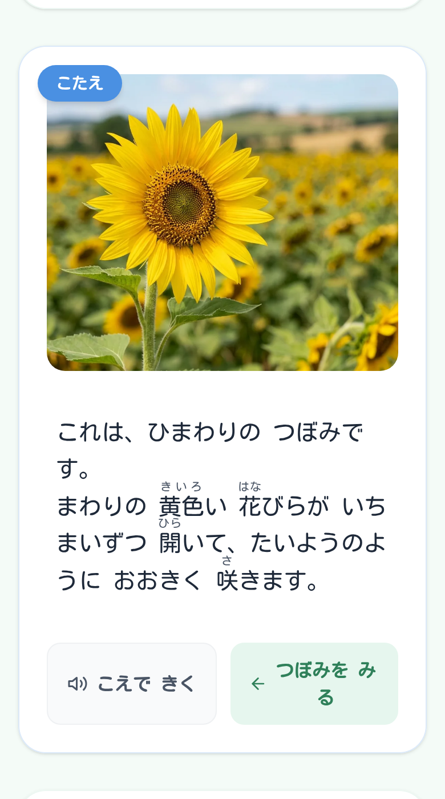

うらを見ると、一文目で名前がわかります。

こうすると、教科書の三つの文とまったく同じ組み立てになります。つぼみの形をくわしく書いた文があり、といがあり、そのあとに答えがある。子どもたちが教科書で読みとった形を、20回くり返して確かめられる形です。

文は20種類ぜんぶ、この型でそろえてあります。とい は形のせつめいで始まり、「これは、なんの つぼみでしょう。」で終わる。こたえ は「これは、なんの つぼみです。」で始まり、咲きかたのせつめいが続く。どのカードを開いても同じ並びなので、二枚目から先は、子どもたちのほうが先に文の形を言い当てるようになると思います。

教科書の本文をそのまま持ってきたところは一つもありません。教科書と同じ文型と順序にそろえて、新しく書き起こしたものです。

## 🥦 ブロッコリーは、つぼみを 食べています

上のタブで、なかまわけができます。にわ・みちばたの はな と、やさい・くだものの はな です。

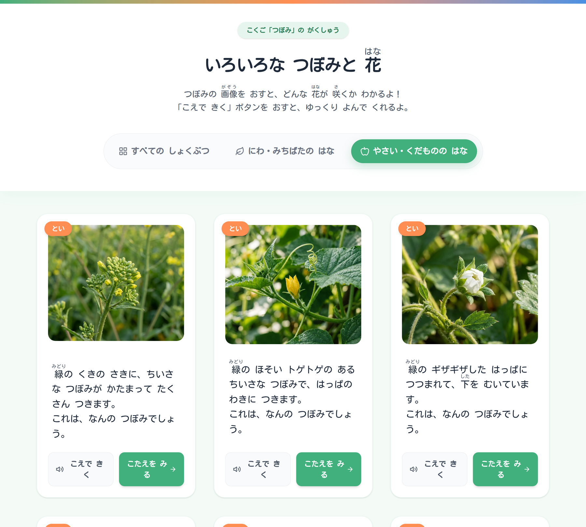

やさい・くだもののタブ。菜の花、キュウリ、いちご、かぼちゃ、おくら、りんご、みかん、ブロッコリーの8種類が残ります。

こちらを入れたのは、花が咲くのは花だんの中だけではない、と気づいてほしかったからです。いちごの白い花も、かぼちゃのラッパのような黄色い花も、給食や家の食卓につながっているものばかりです。

菜の花の こたえ の文には、下のほうから順番に咲いていく、と書いてあります。一本のくきに、咲いた花とまだ咲いていないつぼみが同時についている。教室の花びんに一本さしておくと、この文がそのまま目の前で確かめられます。

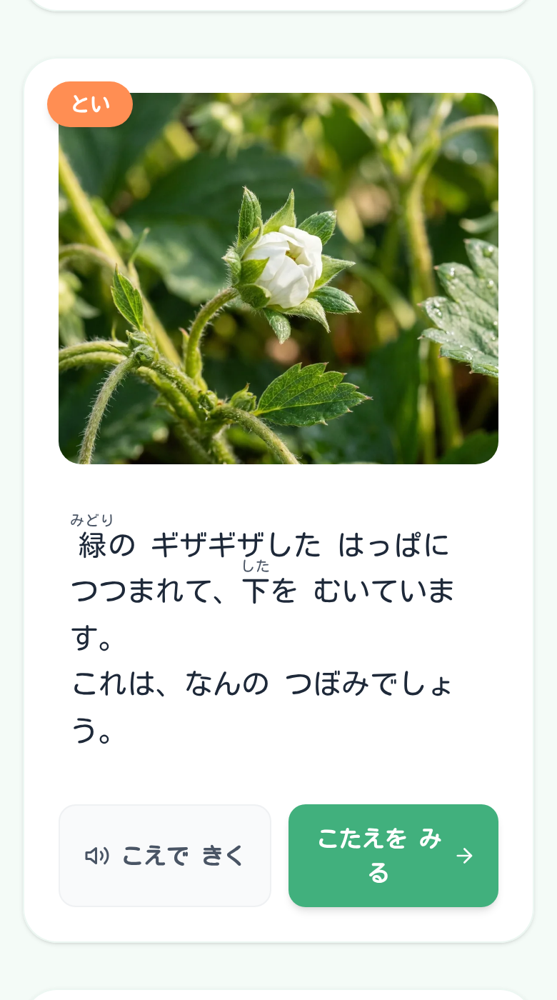

緑の ギザギザした はっぱに つつまれて、下を むいています。

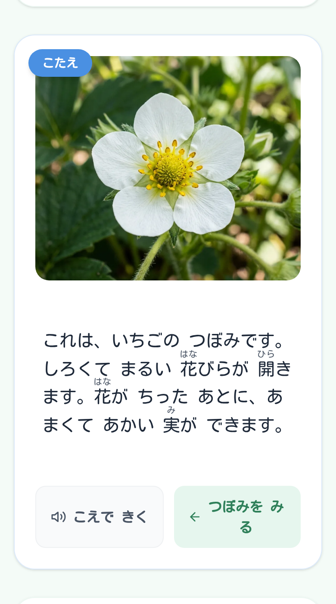

花が ちった あとに、あまくて あかい 実が できます。

いちご の こたえ の文は、花のあとに実ができるところまで書いてあります。そこを取り立てて説明はしていません。気づいた子が自分で言い出すぶんには、それでいいと思っています。

おくら の こたえ の文には、あさに咲いて夕方にはしぼんでしまう、と書いてあります。一日で終わる花があることは、20枚を通しでめくらないと出てきません。ここは、時間があるときに全部見せてほしいところです。

ブロッコリーの とい の文だけ、ほかと少しちがいます。形のせつめいのあとに、こう書き足してあります。「わたしたちが いつも 食べている ところです。」。

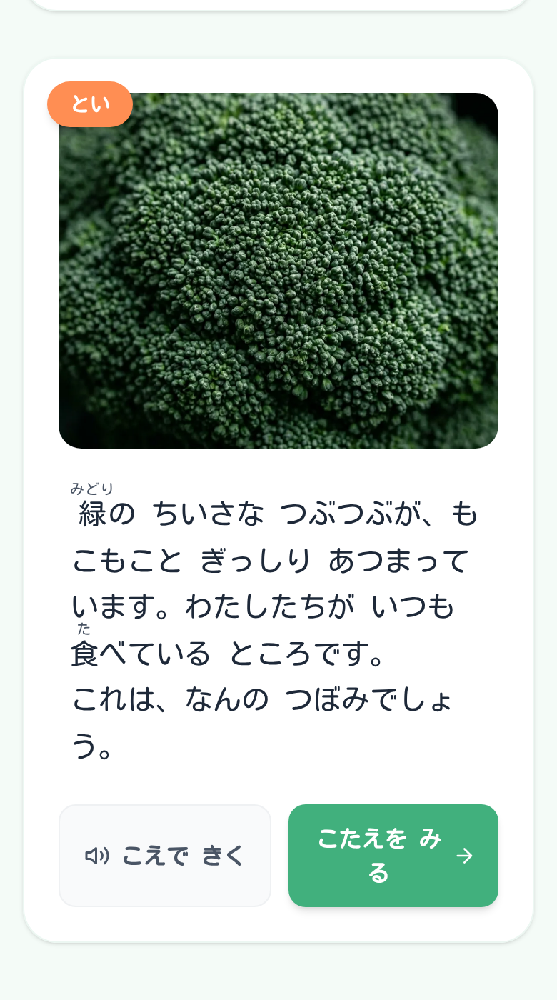

緑の ちいさな つぶつぶが、もこもこと ぎっしり あつまっています。

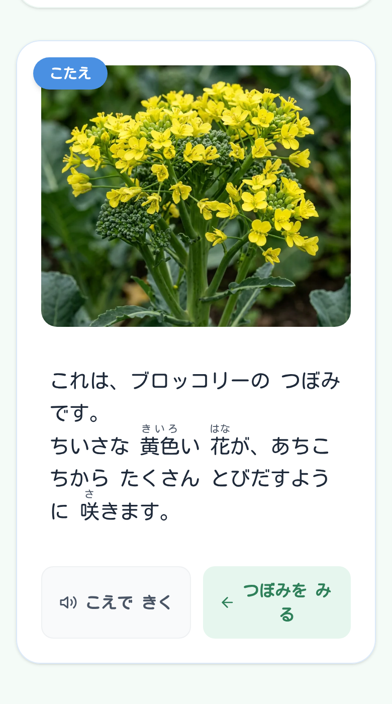

そのつぶつぶが開くと、黄色い花がとびだすように咲きます。

いつも食べているあの緑のつぶが、ぜんぶつぼみだった。国語の時間に見ておくと、給食の時間にもう一度思い出せる一枚です。教科書の三つは、あさがお、はす、ききょうと、どれも見て楽しむ花です。やさい・くだもののタブは、そこに入っていないほうを集めたものになっています。

## ✨ 導入のメリット

三つのいいことが期待できます。

一つ目は、季節をまたいで見せられることです。6月にひまわりを、冬にさくらを出せます。実物が手に入らない時期のつぼみも、その日の授業で見くらべられます。

二つ目は、字を読むのに時間がかかる子が、自分のペースで進めることです。こえで きく のボタンは、といの面にも、こたえの面にもあります。先生に読んでもらう順番を待たずに、自分で押して、聞きたいだけ聞ける。紙の図鑑だと、読めない子はその場で手が止まります。ここが大きく違うところだと思っています。

三つ目は、話し合いが起きやすいことです。とい の面には答えが書いてありません。写真と、形をせつめいする文だけです。だから、裏返すまでのあいだに、あれかな、これかなと言い合う時間ができます。答えを言ってしまう子がいても、手もとの端末で自分でめくれば確かめられるので、けんかになりにくい。

紙の図鑑でもできるのでは、と思われるかもしれません。ちがうのは、答えが裏にあることです。図鑑は名前と写真が同じページに並んでいるので、開いた瞬間に答えが見えてしまう。予想する時間を作るには、先生が手で隠すしかありません。このアプリは、その隠す役をカードのほうに持たせただけです。

一つ、はっきり書いておきます。このアプリの写真は40枚とも、生成AIで用意した画像です。実際に撮影した写真ではありません。本物の植物のように見えますが、実物の記録ではないので、観察のかわりにはなりません。実物を見る学習と組み合わせて、こんな形だったかなと思い出したり、その季節に見られない植物を補ったりする使い方を想定しています。

画面のいちばん下にも、同じことを書いてあります。

生活科の観察カードの代わりに使うのは、やめてください。校庭に出て、本物のつぼみを触ってから、教室でこれを開く。その順番でなら、意味があると思っています。あさがおを育てている1年生なら、自分の鉢のつぼみと画面のつぼみを見くらべる、という使いかたもできます。あさがお自体はこの20種類に入れていないので、そこは本物の出番です。

## 🛠️ 【管理者向け】導入手順

配信しているアドレスは、次の一つだけです。

https://tsubomi-learning.giga-school.com/

校内のフィルタリングで許可が必要になるのは、tsubomi-learning.giga-school.com と、文字の書体を読みにいく fonts.googleapis.com、fonts.gstatic.com の三つです。書体の二つがふさがれていても、端末に入っている書体で表示されるので、内容はそのまま読めます。申請が通りにくい学校なら、一つ目だけ通してもらえれば動きます。

端末の種類は問いません。Chromebook でも iPad でも Windows でも、ブラウザがあれば同じ画面が出ます。入れるものがないので、情報担当の先生の作業は、フィルタリングの許可だけで終わります。

アカウントもログインもいりません。名前を入れる画面も、クラスを選ぶ画面もありません。ひらいた瞬間からカードが並びます。

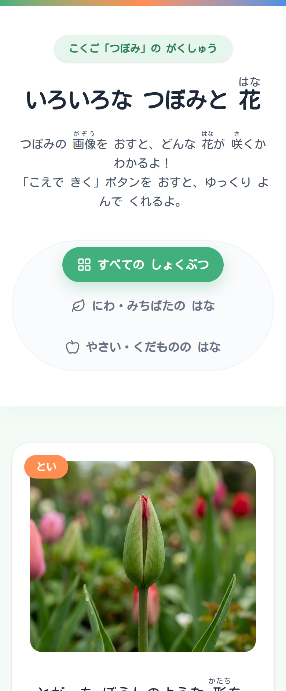

縦に持つと1列になります。ここまで、ひとつも入力していません。

学習の記録は残りません。何枚めくったか、どのカードを見たかを保存する仕組みを持っていないからです。点数もつかない作りです。外へ送るデータも持っていません。共用の端末でも、次に使う子に前の子の記録が見えることはありません。逆に言えば、どの子がどこまで見たかを先生の手もとに集めるのも無理です。そこは紙のワークシートに任せました。

くわしい取りあつかいは、次のページに書いてあります。

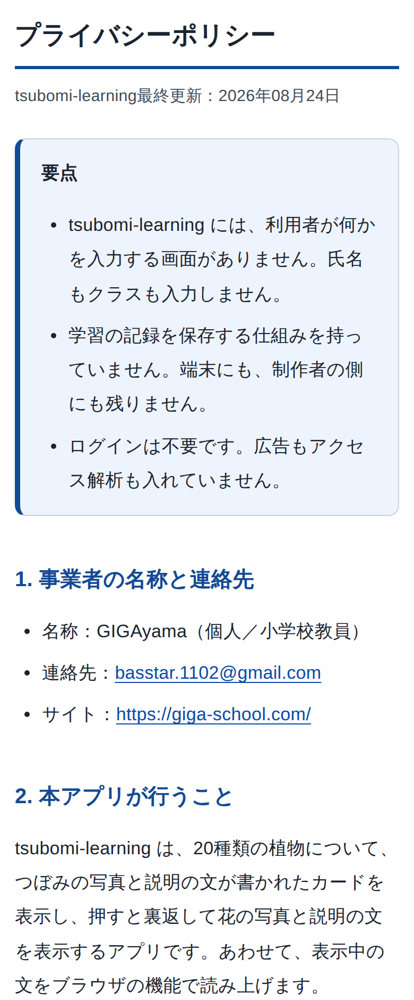

https://tsubomi-learning.giga-school.com/privacy.html

写真は40枚で、あわせて3.3メガバイトほどです。最初に開いたときにまとめて読みこむのではなく、画面を送って必要になったところから読みこみます。とはいえ、インターネットにつながっていないと開けません。電波の弱い教室で使う予定があるなら、授業のまえに1台で開いて、絵が出るところまで確かめておいてください。

画面の幅で、並ぶ列の数が変わります。横に広い画面なら3列、タブレットを横に持てば2列、縦に持てば1列です。電子黒板に映すときは、ブラウザの拡大を使って1枚を大きくしてください。うしろの席からでも文が読めます。

読み上げは、端末に入っている日本語の声を使います。声が入っていない端末では、こえで きく をおしても何も起こりません。そのほかの操作はそのまま使えます。学校の端末は同じ設定で配られていることが多いので、1台で試せば全台の見当がつきます。

並べかえや検索の窓は入れていません。カードの順番はいつも同じで、チューリップから始まってブロッコリーで終わります。授業で「三つ目のカードを見てください」と言えるようにするためです。順番が毎回変わると、電子黒板の画面と子どもの手もとの画面がずれてしまいます。

印刷は考えていません。紙に出すと、めくるところが消えてしまうからです。掲示物が必要なときは、教科書会社の資料か、実際に撮った写真を使ってください。

## 📖 【利用者向け】使い方のガイド

1. ブラウザで https://tsubomi-learning.giga-school.com/ をひらきます。電子黒板でも、子どもの端末でも、出てくる画面は同じです。
2. カードのおもてを見て、つぼみの形をたしかめます。写真の下の文を声に出して読ませると、形をあらわす言葉に目が向きます。
3. 文が読みにくい子には、こえで きく をおさせます。もう一度おすと止まります。
4. 「これは、なんの つぼみでしょう。」まで読んだら、答えを予想させます。ここで少し待つと、まわりの子と話し始めます。
5. カードのどこか、または こたえを みる をおして裏返します。花の写真と答えの文が出ます。
6. こたえの文の一文目が「これは、なんの つぼみです。」の形になっていることを確かめます。教科書のあさがお、はす、ききょうと同じ並びです。
7. 上のタブをおすと、なかまわけができます。

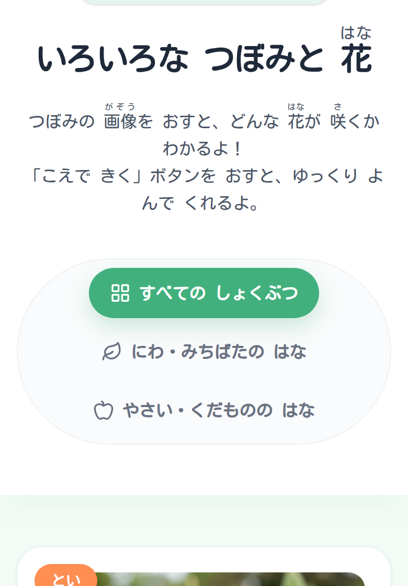

三つのタブ。いま選んでいるものが緑色です。

8. にわ・みちばたの はな をおすと、花だんや通学路で見かける12種類だけが残ります。
9. やさい・くだものの はな をおすと、8種類に切りかわります。ここで、やさいにも花が咲くことに気づかせる展開ができます。
10. すべての しょくぶつ に戻すと、20種類が並びます。このとき、裏返していたカードはおもてに戻っています。
11. 画面をいちばん下まで送ると、がくしゅうの ポイント が置いてあります。ふりかえりのときに、ここを読ませてください。
12. 電子黒板だけで進めるときは、1枚を大きくしてから、といの文を全員で読み、予想を出させてから裏返します。手もとの端末を配るのは、そのあとにすると、めくる音が重なりません。

読み上げを使う子が何人もいる学級なら、その子たちにイヤホンを配ってください。20台ぶんの声が重なると、どれが自分の端末かわからなくなります。ボタンの文字が とめる に変わっているかどうかで見分けはつきますが、1年生には少し難しいところです。

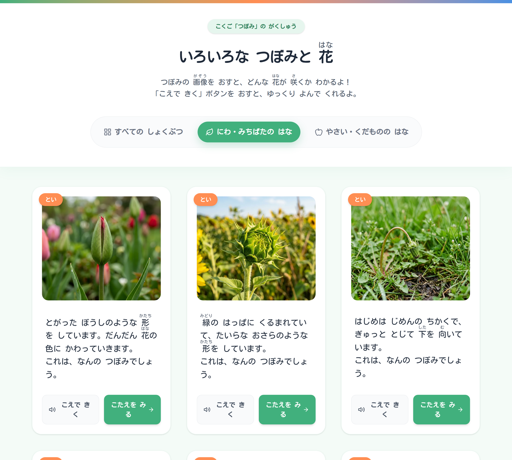

にわ・みちばたのタブ。チューリップ、ひまわり、たんぽぽから始まる12種類です。

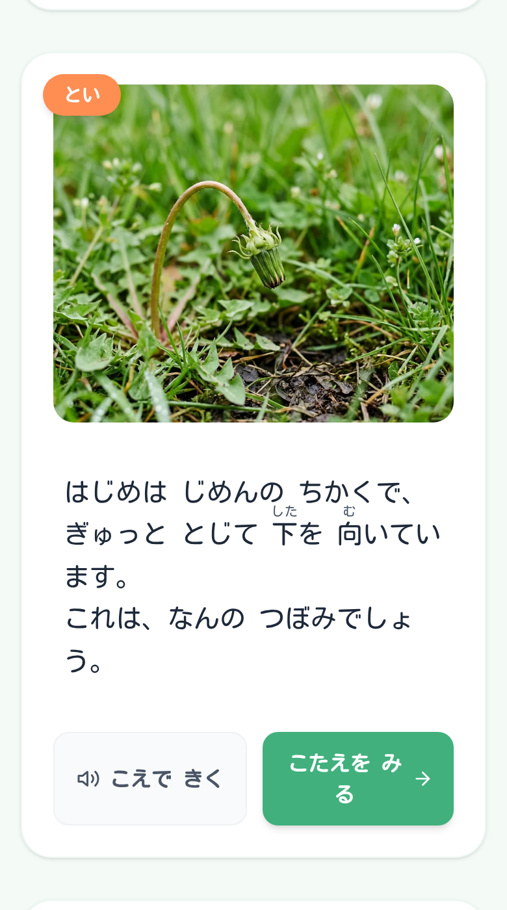

たんぽぽは、はじめ下を向いています。

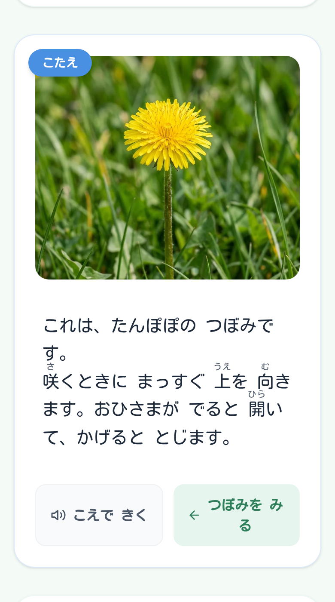

おひさまが でると 開いて、かげると とじます。

たんぽぽの こたえ の文には、咲いたあとに開いたり閉じたりする話まで入れてあります。通学路で毎日見ているものなので、明日の朝、外に出てそのまま確かめられます。

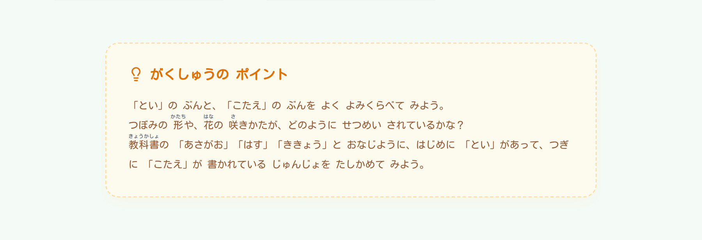

ふりかえりの手がかり。教科書の三つと同じ並びをたしかめる言葉が置いてあります。

## 📝 まとめ

このアプリがしているのは、写真を出すことと、文を読み上げることだけです。採点もしませんし、記録も残しません。増やそうと思えば増やせるところですが、いまは足していません。

とい の文を読んで、形を見て、あれかな、これかなと言い合う。裏返して、当たったりはずれたりする。その数十秒のあいだ、先生は何もしなくていい。教室を歩いて、どの子がどの言葉に反応したかを見ていられます。ICT を使う意味は、この時間が生まれるところにあると思っています。準備の作業が減ることより、こちらのほうがずっと大きい。

いまの20種類は、つぼみと花の二枚で完結しています。たんぽぽのように、咲いたあとにもう一段ある植物をどう扱うかは、まだ決めていません。20種類を増やすかどうかも同じです。

明日の1時間ぶん、教材を探すところから始めなくてよくなる。それだけのために作りました。合う合わないは、一度ひらいて、三枚めくってみればわかると思います。よかったら試してみてください。

一歩踏み出そうとする先生を、私はいつでも全力で応援しています。

## 🏷 ハッシュタグ

#小学校 #小学校教員 #国語 #こくご #1年生 #GIGAスクール #ICT教育 #1人1台端末 #教育 #授業づくり #タブレット学習 #Chromebook #iPad #個別最適な学び #特別支援教育 #つぼみと花
